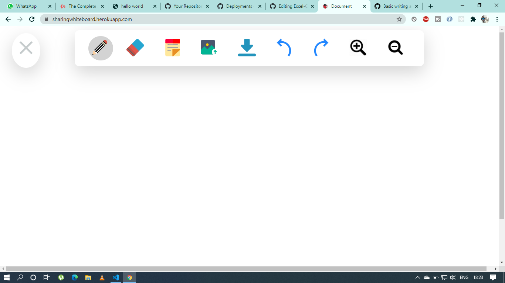

# Final Year Project

## Discription :small_red_triangle_down: :-
Openboard 
Added Functionalities using Canvas & JavaScript library.
This project will solve problems faced in group study while multiple user have to write on the same page.
The idea here is to teach students or group study through whiteboard but in virtual platform.
 
 
 
 ## Technologies :rocket::-
Project is created with:
* Node.js :heavy_check_mark:
* JavaScript :heavy_check_mark:
* Jquery :heavy_check_mark:
* DOM :heavy_check_mark:
* Canvas Tag of HTML :heavy_check_mark:
* HTML/CSS :heavy_check_mark:

## UI Image of the project :-

  
## Deploy Uing Heroku :-
[Click Link](https://white-board-lovepreet.herokuapp.com/)

